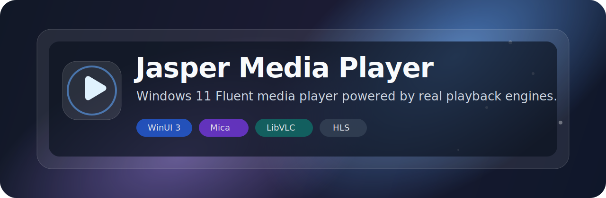

<p align="center">
  
</p>

<h1 align="center">Jasper Media Player</h1>

<p align="center">
  A modern Windows 11 media player with a Fluent interface, Mica styling, local playback, direct URL playback, and HLS stream support.
</p>

<p align="center">
  <a href="../../releases/latest"></a>
  <a href="../../actions"></a>
  
  
</p>

---

## ✨ What is it?

**Jasper Media Player** is a small Windows 11-style media player built with **WinUI 3**, **Windows App SDK**, **LibVLCSharp**, and **VideoLAN.LibVLC.Windows**.

It keeps the app simple: open a local media file, paste a direct stream URL, or play an HLS `.m3u8` stream without needing to install VLC separately.

> This project is not the official VLC desktop app and is not affiliated with VideoLAN. It uses LibVLC/LibVLCSharp packages as playback technology.

## 🖼️ Features

- Native Windows 11-style interface
- Fluent controls and Mica-like app styling
- Open local video/audio files
- Play direct media URLs such as `.mp4`, `.mp3`, and similar files
- Play HLS `.m3u8` streams using the native Windows stream renderer
- Play/pause, stop, seek, volume, and time display
- x64 Windows build target
- No separate VLC installation required for normal use

## 📦 Download

Go to the **latest release** and download the Windows x64 ZIP:

[Download the latest release](../../releases/latest)

After downloading:

1. Extract the ZIP.
2. Open the extracted folder.
3. Run `JasperMediaPlayer.exe`.

Do not run the app directly from inside the ZIP, and do not move only the EXE by itself. The app needs its included DLLs and media files beside it.

## 🧪 Stream URL examples

Try these in the URL box:

```text
https://devstreaming-cdn.apple.com/videos/streaming/examples/img_bipbop_adv_example_fmp4/master.m3u8
```

```text
https://test-streams.mux.dev/x36xhzz/x36xhzz.m3u8
```

Normal YouTube page links are not direct stream URLs, so they are not expected to work in the URL box.

## 🛠️ Build from source

### Requirements

- Windows 11
- Visual Studio 2022 Community
- `WinUI application development` workload
- Developer Mode enabled in Windows settings

### Visual Studio

1. Clone the repository.
2. Open `src/JasperMediaPlayer.sln` or `src/JasperMediaPlayer.csproj`.
3. Set configuration to `Release` and platform to `x64`.
4. Build and run.

### PowerShell

```powershell
git clone https://github.com/JasperSoosaar25/JasperMediaPlayer.git
cd JasperMediaPlayer
dotnet restore .\src\JasperMediaPlayer.csproj
dotnet build .\src\JasperMediaPlayer.csproj -c Release -r win-x64
```

## 🚀 Make a shareable build

Run:

```powershell
.\Build.ps1
```

Or publish manually:

```powershell
dotnet publish .\src\JasperMediaPlayer.csproj -c Release -r win-x64 --self-contained false -p:WindowsPackageType=None -p:WindowsAppSDKSelfContained=true
```

Then ZIP the whole publish folder, not just the EXE.

## 🧱 Tech stack

| Part | Technology |
| --- | --- |
| UI | WinUI 3 |
| App platform | Windows App SDK |
| Local/direct playback | LibVLCSharp + VideoLAN.LibVLC.Windows |
| HLS playback | Native Windows media renderer |
| Language | C# |
| Target | Windows x64 |

## 🧭 Roadmap

- Add app icon and installer
- Add playlist support
- Add drag-and-drop file opening
- Add recent files
- Add fullscreen controls
- Add media info/details panel

## 🤝 Contributing

Contributions are welcome. Open an issue for bugs or ideas, then make a pull request with a clear description of what changed.

## ⚖️ Third-party notices

This project uses third-party media playback packages. See [`THIRD_PARTY_NOTICES.md`](THIRD_PARTY_NOTICES.md) for details.

---

<p align="center">
  Made by Jasper Soosaar
</p>
